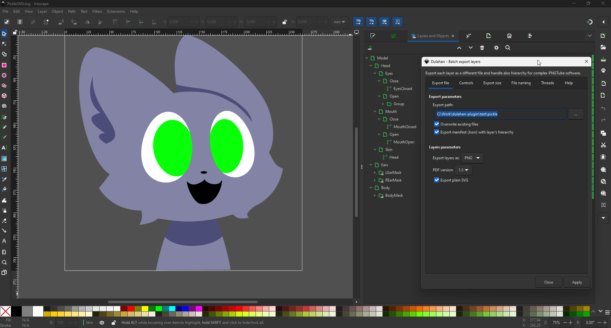
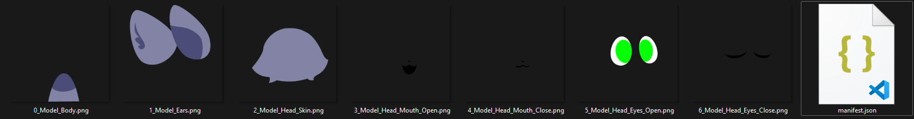
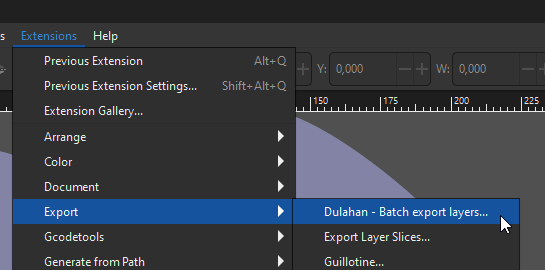
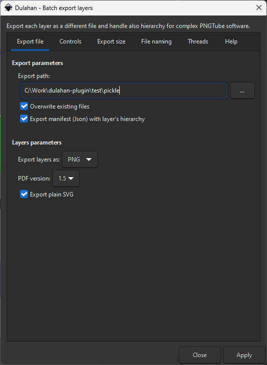
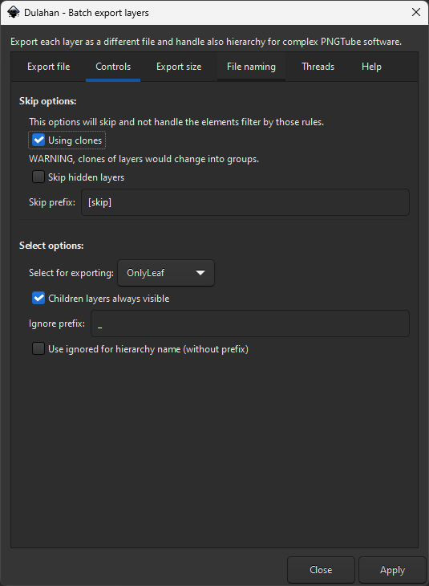
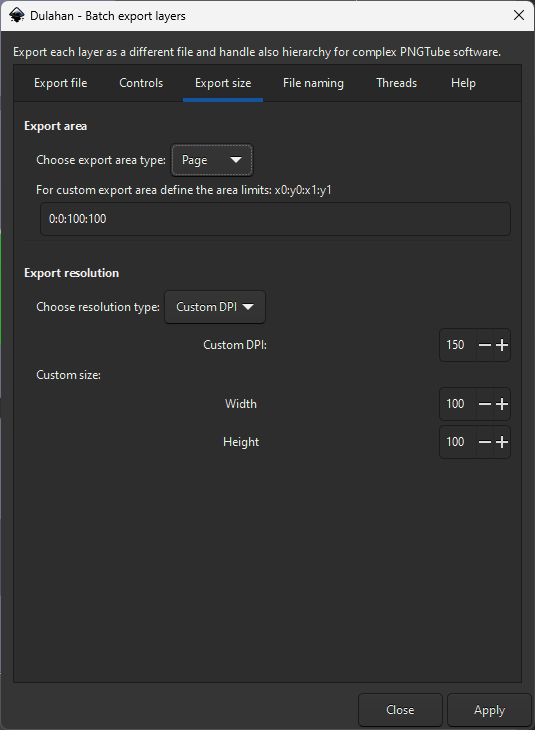
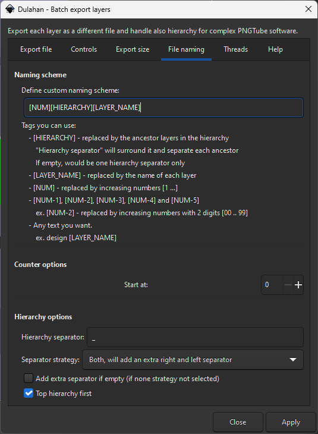
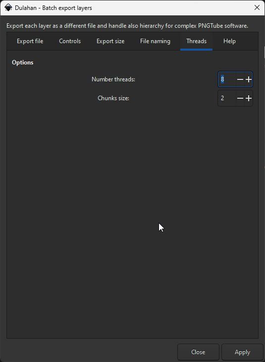
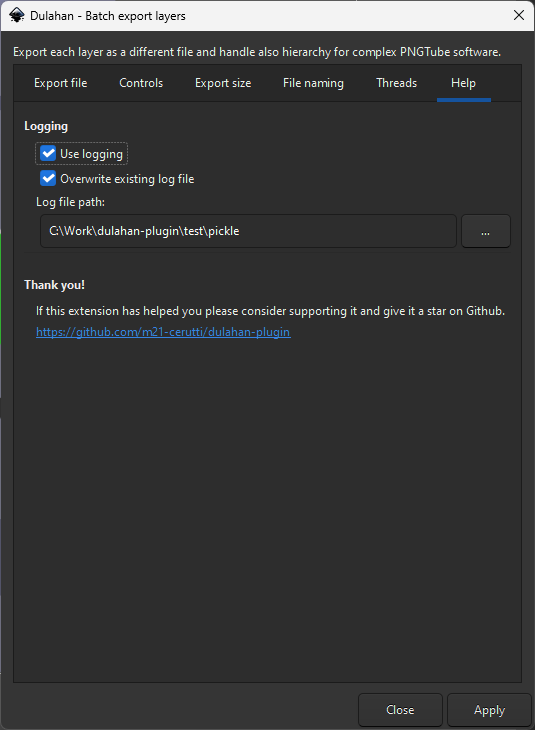

<p align="center">
    
</p>

Based on great [Batch Export Plugin](https://github.com/StefanTraistaru/batch-export), for simpler export you could use it instead.

This extension will help you export your model easily when you have a complex hierarchy for PNGTube software ([PNGTuber+](https://kaiakairos.itch.io/pngtuber-plus), [PNGTuber-Remix](https://mudkipworld.itch.io/pngremix), ...):
- Supports multiple export file formats (SVG, PNG, PS, EPS, PDF, EMF, WMF, XAML).
- Export each layer selected with some rules as a separate file.
- Automated file naming.
- Parrallel export support.
- Manifest JSON.



Asset used from [PNGTuber-Remix]([images/inkscape_main_view.png](https://github.com/MudkipWorld/PNGTuber-Remix)), special thanks to its author [MudkipWorld](https://github.com/MudkipWorld).


<!-- omit in toc -->
## Summary
- [Prerequisites](#prerequisites)
- [Install](#install)
  - [Linux](#linux)
  - [Windows](#windows)
- [Usage](#usage)
    - [Export file](#export-file)
      - [Export parameters](#export-parameters)
      - [Layers parameters](#layers-parameters)
    - [Controls](#controls)
      - [Skip options](#skip-options)
      - [Select options](#select-options)
    - [Export size](#export-size)
      - [Export area](#export-area)
      - [Export resolution](#export-resolution)
    - [File naming](#file-naming)
      - [Naming scheme](#naming-scheme)
      - [Counter options](#counter-options)
      - [Hierarchy options](#hierarchy-options)
    - [Threads](#threads)
      - [Threads parameters](#threads-parameters)
    - [Help](#help)
      - [Help parameters](#help-parameters)
- [Result](#result)
- [Contribute \&\& License](#contribute--license)
  - [Windows tips](#windows-tips)
- [Become a supporter 🙌](#become-a-supporter-)

## Prerequisites

This extension works with **Inkscape 1.4** on Windows 11 with the inkscape installer, and would work on most operating systems. If not please make an issue with the error associated.

## Install

Download this project and copy the extension files (`batch_export.inx` and `batch_export.py`) to the config path of your Inkscape installation.

One simple way of finding the config path is to open Inkscape and go to **Edit > Preferences > System**. The path will be listed in the **User extensions** field. Make sure you restart Inkscape after you copied the extension files at the desired location and the extension will be available in the extensions menu.

### Linux

The default path on Linux is:
```
~/.config/inkscape/extensions
```

If you installed the flatpak version:
```
~/.var/app/org.inkscape.Inkscape/config/inkscape/extensions
```

### Windows

The path on Windows 10 and higher is :
```
C:\Users\[yourWindowsusername]\AppData\Roaming\inkscape\extensions
```
If you don't see the AppData folder, you need to set the windows explorer to show hidden files.

## Usage

After the extension is installed, it can be found in the **Extensions** menu, **Export** submenu.


#### Export file



##### Export parameters
| Name                   | Command         | Description                                                                                                                                                                          |
| ---------------------- | --------------- | ------------------------------------------------------------------------------------------------------------------------------------------------------------------------------------ |
| Export path            | path            | The folder where the files would be exported.                                                                                                                                        |
| Overwring files        | overwrite-files | Owerwite exisitng files when exporting.                                                                                                                                              |
| Export manifest (JSON) | export-manifest | Export a JSON file with the layer hierarchy and path of exported file associated. See [Pickle](test/pickle/manifest.json) or [Abstract](test/abstract/manifest.json) for the format. |

##### Layers parameters
| Name              | Command            | Description                                                       |
| ----------------- | ------------------ | ----------------------------------------------------------------- |
| Export layer type | export-type        | Supported formats: SVG, PNG, PS, EPS, PDF, EMF, WMF, XAML.        |
| PDF Version       | export-pdf-version | PDF version to be used (1.4 or 1.5).                              |
| Export plain SVG  | export-plain-svg   | Option to remove any Inkscape-specific SVG attributes/properties. |

#### Controls



##### Skip options

When skipped, the whole branch would be skipped, even if there is children layers, and would not appear in the exported files.

| Name               | Command            | Description                                                                                                                             |
| ------------------ | ------------------ | --------------------------------------------------------------------------------------------------------------------------------------- |
| Using clones       | using-clones       | Select this option to not skip clones (original will be copied). Clone of layers will be changed into groups to avoid unwanted exports. |
| Skip hidden layers | skip-hidden-layers | Skip hidden layers. Use this option if you want what you are currently seing in the ediotr strictly.                                    |
| Skip prefix        | skip-prefix        | Skip layers with a specific prefix in their name. By default `[skip]`.                                                                  |

##### Select options

When ignored, a layer would not be exported but would appear in the exported files if they are child of an another exported layer.

| Name                           | Command              | Description                                                                                                                                                                          |
| ------------------------------ | -------------------- | ------------------------------------------------------------------------------------------------------------------------------------------------------------------------------------ |
| Select for exporting...        | select-behavior      | - `OnlyLeaf` when you want only layers that doesn't have **ignored** layers as direct children, <br/>- `ParentsAndLeaf` for the whole layer tree except **ignored** and **skipped**. |
| Children layers always visible | child-layers-visible | Export the layer with all the children layers visible.                                                                                                                               |
| Ignore prefix                  | ignore-prefix        | Ignore layers for export with a specific prefix.                                                                                                                                     |
| Use ignored for hierarchy name | use-ignored-name     | Use ignored name for ``HIERARCHY`` naming (see [Naming section](#hierarchy-options)). Use this options if you want parent layers ignored in the naming for example.                  |

#### Export size



##### Export area
| Name                    | Command          | Description                                                                                                                                                                             |
| ----------------------- | ---------------- | --------------------------------------------------------------------------------------------------------------------------------------------------------------------------------------- |
| Choose export area type | export-area-type | `Page` for exporting the page defined in the document settings. <br/> `Drawing` for exporting the whole drawing (ignoring page size). <br/> `Custom` for exporting a custom area. <br/> |
| Custom area size        | export-area-size | Used when `Custom` is selected. Would export the rectangle define by **x0:y0:x1:y1**. In the example, a square of 100px.                                                                |


##### Export resolution
| Name                   | Command           | Description                                                                                                                                                                     |
| ---------------------- | ----------------- | ------------------------------------------------------------------------------------------------------------------------------------------------------------------------------- |
| Choose resolution type | export-res-type   | - `Default` for using the default document resolution. <br/>- `Custom DPI` for using a custom dpi for export. <br/>- `Custom size` for using a custom width and height (pixel). |
| Custom DPI             | export-res-dpi    | Used when `Custom DPI` is selected.                                                                                                                                             |
| Width                  | export-res-width  | Used when `Custom size` is selected.                                                                                                                                            |
| Height                 | export-res-height | Used when `Custom size` is selected.                                                                                                                                            |

#### File naming




##### Naming scheme
| Name                 | Command       | Description                                                                                                                                                                                                                                                                                                                  |
| -------------------- | ------------- | ---------------------------------------------------------------------------------------------------------------------------------------------------------------------------------------------------------------------------------------------------------------------------------------------------------------------------- |
| Custom naming scheme | name-template | Template for constructing the final name. Allowed keywords:<br/>- `HIERARCHY` for the hierarchy of layers, separated by **Hierarchy separator**. <br/>- `LAYER_NAME` for the current layer name when exporting. <br/>- `NUM, NUM-1, ..., NUM-X` the global counter when exporting, X the number of digits, **up to 5**.<br/> |

##### Counter options
| Name        | Command      | Description                                 |
| ----------- | ------------ | ------------------------------------------- |
| Start count | number-start | The starting number for the global counter. |


##### Hierarchy options
| Name                         | Command               | Description                                                                                                                                                                                                                                                           |
| ---------------------------- | --------------------- | --------------------------------------------------------------------------------------------------------------------------------------------------------------------------------------------------------------------------------------------------------------------- |
| Hierarchy separator          | hierarchy-separator   | The separator used between layers by `HIERARCHY` like `...<layer1><separator><layer2>...`                                                                                                                                                                             |
| Separator strategy           | separator-strategy    | Where to add the separator. <br/> - `right` would alwais add the separator to the right.<br/>- `left` would alwais add the separator to the left.<br/>- `both` would alwais add the separator on both right and left.<br/>- `none` would not add the separator. <br/> |
| Add extra separator if empty | empty-extra-separator | Add an extra separator if the `HIERARCHY` is empty (if none strategy not selected).                                                                                                                                                                                   |
| Top hierarchy first          | top-hierarchy-first   | Order as first the top parent of `HIERARCHY`, otherwise the direct parent of the layer would be first.                                                                                                                                                                |

#### Threads



##### Threads parameters
| Name           | Command        | Description                                                                                     |
| -------------- | -------------- | ----------------------------------------------------------------------------------------------- |
| Number threads | number-threads | Number of thread used to accelerate the export. Depend on your system and the number of layers. |
| Chunks size    | chunks-size    | Maximum of export per thread. Depend on your system and the number of layers.                   |

#### Help



##### Help parameters
| Name                        | Command       | Description                                                                                                                                        |
| --------------------------- | ------------- | -------------------------------------------------------------------------------------------------------------------------------------------------- |
| Use logging                 | use-logging   | Debug the export inside a log file. If there is error, it is recommended to retry with this option to send it with the bug report.                 |
| Overwrite existing log file | overwrite-log | Overwrite the log file, otherwise would append the current execution at the end of the file (watch out to not spam export when using this option). |
| Log file path               | log-path      | The path of the log file.                                                                                                                          |

## Result

This is the result of using the extension to export the layers of the [file](test/pickle/PickleSVG.svg) shown in the first screenshot.


As you can see it support clones, clipping groups and export of hidden layers to allow a non destructive workflow and allow edition / adding an element to a model. The JSON can be used then if you are making a plugin in your favorite PNGTube software

You have also others examples in [test/](test/).

> ⚠️ **However, it is not adapted to scale and have animated elements in it**.
> The use case is really specific, and you would need third parties animation software after that to make specific element animations, or manually handle it with layers names.

> 💡 For vector animation you could use different solution others than inkscape like [SVGGator](https://www.svgator.com/), [Cavalry](https://cavalry.scenegroup.co/), [Adobe After Effect](https://www.adobe.com/products/aftereffects.html),...


## Contribute && License

Feel free to modify it to suit your needs. If you have tested on others system than windows, feel free to submit a pull request for the code or even the documentation.

See the the [MIT](LICENSE.md) license for more.

### Windows tips

If you want to make some modifications you can use [symlink.py](symlink.py) to make some symlinks and work with your repository. You need to have python installed and in your `PATH` environment variables, and then launch it with admions privileges.

## Become a supporter 🙌

This repositorey have helped you ?

[](https://ko-fi.com/X8X6ABO4R)

